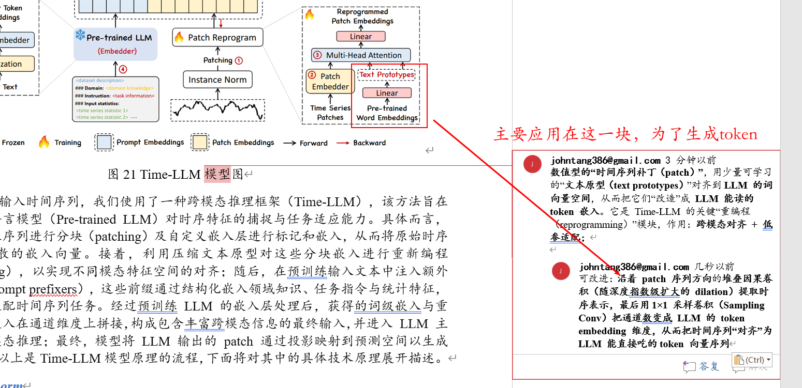
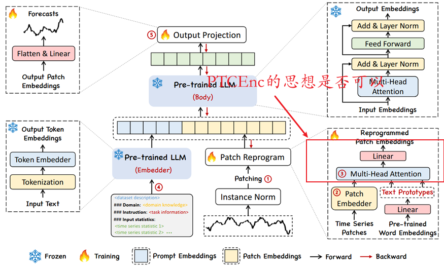
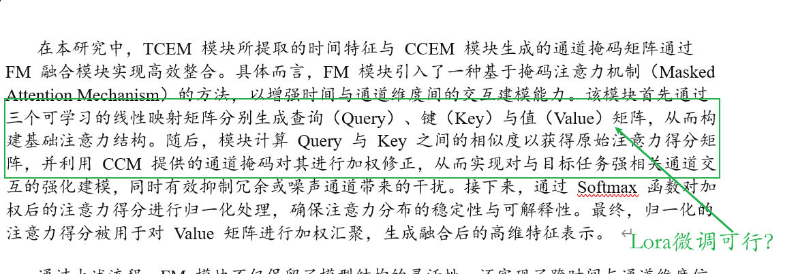
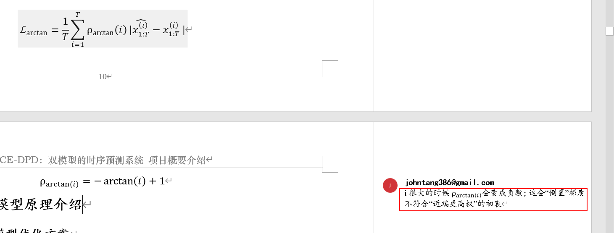
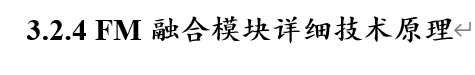
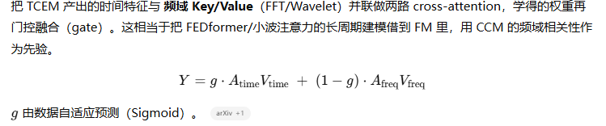

##  **Time-DPD** 的时序预测模型

> 核心思想：用一个经过特殊优化的、参数量更小的语言模型，来更好地处理小规模的时序预测任务。所以我们将会按照【理解 Time-LLM 模型-> 如何改进 Time-LLM 模型】来理解 Time-DPD 的时序预测模型做了哪些优化。

### Time-LLM 模型的基础流程

Time-DPD 是在 Time-LLM 的基础上改进的，所以首先需要理解 Time-LLM 的基本工作原理。这个模型可以分为以下三个步骤：

- **输入转换（Input Conversion）**：这一步的目标是把原始的时间序列数据，转换成大语言模型（LLM）能理解的、类似文本的格式。
  - **可逆实例归一化**：就像我们在处理图像数据时会进行归一化一样，这里对时间序列的每个通道（比如股票价格、成交量等）进行归一化。不同的是，这种归一化是可逆的，可以保证在转换后还能恢复原始数据的动态特征。
  - **分块与嵌入**：接着，模型会把时间序列数据分割成一个个小的“补丁”（Patch），就像把一段文章分成一个个句子一样。然后，通过一个 **修补与嵌入** 操作，把这些补丁转换成一个个紧凑的向量（即嵌入表示），这些向量包含了每个小块里的关键信息。
  - **跨模态对齐**：为了让 LLM 更好地理解这些向量，模型会引入一个“小型文本原型集合”。想象一下，这些原型就像是提前准备好的“标签”，通过 **多头交叉注意力** 机制，模型会把时间序列补丁的嵌入与这些文本原型进行关联，实现时间序列数据与文本语义的对齐。
  - **注入任务指令（Prompt-as-Prefix）**：最后，模型会在输入数据前加上一些“指令”（Prompt）。比如，你可以告诉模型“请预测未来 7 天的股票价格”，或者提供一些关键统计数据，这能帮助 LLM 更准确地理解任务目标。
- **冻结的预训练语言模型（Frozen LLM）**：这是整个流程的核心，也是 Time-LLM 模型的精髓。
  - **冻结**：这里的重点是 **“冻结”**。像 Llama 或 GPT-2 这样的庞大语言模型，它们的参数量非常大。为了节省计算资源，在训练时只更新输入转换和输出投影部分的参数，而 **LLM 的主体部分参数是完全不动的**。这样模型能够利用 LLM 强大的推理能力，又不需要重新训练整个庞大的模型，极大地降低了成本。
- **输出投影（Output Projection）**：在 LLM 处理完数据后，会输出一堆向量。
  - **展平与线性投影**：这一步就是把这些向量“展平”，并通过一个简单的 **线性层**（就像一个简单的全连接神经网络）把它们转换成我们需要的最终预测结果。

### Time-DPD 的优化策略：如何改进 Time-LLM

现在我们来看看 Time-DPD 在 Time-LLM 基础上做了哪些改进，这也是你最需要理解的部分。它主要集中在 **“如何获得一个更好的 LLM”** 和 **“如何更好地使用这个 LLM”** 这两点上。

#### 优化点一：知识蒸馏（Knowledge Distillation）

- **核心思想**：用一个更强大的“教师模型”（Teacher Model）来教导一个更轻量级的“学生模型”（Student Model）。
- **具体步骤**：
  1. **构建教师模型**：这里使用一个叫做 **DeepSeek-R1** 的强大模型作为教师。
  2. **生成高质量样本**：教师模型会生成大量（约 80 万条）高质量、结构化的训练样本，这些样本包含了数学、代码、科学等多种领域的推理知识。这些样本经过筛选，确保质量很高。
  3. **学生模型学习**：一个参数量更小的 **Qwen-7B** 模型被用作学生模型。在 **监督微调** 过程中，学生模型通过学习教师模型生成的样本，逐步掌握了教师模型的推理能力，但参数量却大大减少。
- **结果**：通过这个过程，得到了一个 **DeepSeek-R1-Distill-Qwen-7B** 蒸馏模型。它在保持强推理能力的同时，大幅减少了参数量和计算需求，使其更适合资源受限的环境。

#### 优化点二：提示调整（Prompt Tuning）

- **核心思想**：不是手动去写那些固定的“指令”，而是让模型自己去学习如何生成最好的指令。
- **具体步骤**：
  1. **替换 LLM**：用上面蒸馏得到的 **DeepSeek-R1-Distill-Qwen-7B** 模型替换了 Time-LLM 架构中的原始 **llama-7B** 模型。
  2. **冻结参数 + 初始提示**：和 Time-LLM 一样，新的 LLM 模型主体参数也是冻结的。同时，模型会使用一些 **手工设计的初始提示** 作为起点。
  3. **Prompt Tuning 微调**：这一步是关键！模型不直接去修改庞大的 LLM 参数，而是只 **微调一些专门用于生成提示的标记（Prompt Tokens）**。这些标记可以看作是可学习的“指令”，模型会通过训练来找到最能激活其时序理解能力的提示。
- **结果**：这种方法克服了手动设计提示的局限性，使得模型能更好地适应不同数据集中的多样化信息，从而在各种规模的数据集上都取得了显著的性能提升。

---

### 总结与核心概念

你可以把 **Time-DPD** 的整个流程想象成一个熟练的“学生”（学生模型）在和一个博学的“老师”（教师模型）学习，然后又学会了如何高效地给自己“打气”和“下指令”（Prompt Tuning）。

下面是几个关键概念的总结，它们是理解这个模型的基石：

- **知识蒸馏（Knowledge Distillation）**：用大模型的知识来指导小模型的学习，从而让小模型在保持高性能的同时，参数更少、计算成本更低。
- **提示调整（Prompt Tuning）**：不直接修改大型模型的参数，而是通过微调一些轻量级的提示标记，来引导模型更好地完成特定任务。这是一种高效的微调方法，尤其适用于冻结大模型的场景。
- **冻结的预训练语言模型（Frozen LLM）**：利用 LLM 强大的通用能力，但只训练其外部的轻量级部分，避免了重新训练整个巨型模型的昂贵成本，大大加速了模型的部署和应用。
- **可逆实例归一化**：一种特殊的归一化方法，能够保证数据转换后还能还原，从而更好地保留原始时序数据的动态特征。

希望这个解释能帮助你快速理解这个模型的流程和核心思想。这个模型最突出的优势就是 **“高效”**，它在利用大语言模型强大能力的同时，通过一系列巧妙的优化，解决了在小规模数据集上微调大模型的计算和数据稀缺问题。

### 深入理解

- **4 个阶段**：Normalize（可逆归一化）→ Patch（切片嵌入）→ **Deprogram/Repogram**（文本原型重编程 ＋ 前缀提示）→ Predict（冻结 LLM + 线性头输出）

- **3 处轻量可训练**：[RevIN](#第二种跳转) 的仿射参数、**文本原型** ＋ **软提示**、输出线性投影
- **2 条流程**：训练（调软提示/原型/头）vs 推理（同路、最后做逆归一化）
- **1 个冻住的大模型**：LLM（由 **DeepSeek-R1-Distill-Qwen-7B** 替换原 llama-7B）

### 创新之处（比较 Time-LLM 而言）

**骨干替换**：llama-7B → **DeepSeek-R1-Distill-Qwen-7B**（先验推理更强，参数相近/更省）

**提示优化**：手工硬提示 + **Prompt Tuning（软提示）**，覆盖小数据的多样场景

**小数据友好**：仍然冻结 LLM，仅训练前后小层；结合 RevIN+原型重编程，缓解分布偏移与少样本

### <a name="第二种跳转"> RevIN </a>

**RevIN（Reversible Instance Normalization，可逆实例归一化）**：它是为 **时序预测中的分布/尺度漂移** 设计的“**先按样本归一化、推理后再精确反归一**”的层。要点是：**标准化发生在输入前，反标准化发生在输出后**；中间的预测模型无需管数据的不同量纲与基线差异。

# 1) 为什么需要 RevIN？

- **现实问题**：不同样本（不同站点/用户/传感器）或同一序列不同时间段，**均值与方差不同**（分布偏移）。直接训练一个统一模型会被这些尺度差异干扰，尤其是 **小数据** 时更难泛化。
- **常规归一化的不足**：BatchNorm/LayerNorm/InstanceNorm 只做 **正向归一化**，**不会把预测结果再映射回原量纲**；预测值因此失去物理含义（单位、绝对水平）。
- **RevIN 的关键优势**：
  1. **逐样本逐通道** 的标准化，抵抗尺度/基线漂移；
  2. **在输出端做完全可逆的“反归一化”**，把预测值还原到原量纲，保留物理意义；
  3. 引入 **可学习仿射参数**（γ、β），让模型 **自动调节“归一化的强度/风格”**，必要时可接近“不过度归一”的状态。

------

# 3) 它和常见归一化的区别

| 方法         | 归一化维度       | 是否反归一化 | 是否逐样本 | 作用目的                      |
| ------------ | ---------------- | ------------ | ---------- | ----------------------------- |
| BatchNorm    | 批+特征          | 否           | 否         | 稳定梯度、加速收敛            |
| LayerNorm    | 特征             | 否           | 是         | 稳定层内统计                  |
| InstanceNorm | 空间/时间        | 否           | 是         | 风格消除                      |
| **RevIN**    | **时间(逐通道)** | **是**       | **是**     | **抗尺度漂移 + 保留物理量纲** |

# 参考论文

## [Time-MoE](https://ar5iv.labs.arxiv.org/html/2409.16040v4)

> [代码地址](https://github.com/Time-MoE/Time-MoE)

## Large Language Models are Few-shot Multivariate Time Series Classifiers

[论文地址](https://arxiv.org/abs/2502.00059)

**PTCEnc：补丁化的时域卷积编码器**
 将多变量序列切成补丁后用轻量时序卷积对齐到 LLM 的文本嵌入空间，再与 LLM 解码端交互（论文用于少样本分类）。这给出一个 **从数值序列 → 语言嵌入** 的更稳桥接器

1. **PTCEnc**：补丁化 + 膨胀因果卷积栈，对齐到 LLM 嵌入维；经消融验证必要性。把多变量时序按 **patch** 切成“更短、更稀疏”的 **patch 序列**，再用 **沿着 patch 序列方向** 的 **堆叠因果卷积（随深度指数级扩大的 dilation）\**提取时序表示，最后用\** 1×1 采样卷积（Sampling Conv）\**把通道数变成 \*\*LLM 的 token embedding 维度\*\*，从而把时间序列“对齐”为 LLM 能直接吃的\** token 向量序列**

 **PTCEnc** 作为 *“数值 →token”* 的更强前端，接在 Time-LLM 的 **Reprogrammed Patch Embedding（RPE）** 前/内，用它沿 **patch 序列** 建模，再把输出 **对齐到 LLM 的嵌入维**

2. [LoRA 微调](https://zhuanlan.zhihu.com/p/702629428)：不太可行的样子；**精调 Q/K/V** 指把 LoRA **插在注意力的投影矩阵** 上；参数量极小、收敛快，特别适合 **小样本/少算力** 场景；主要是场景适合小样本的场景；

## 损失函数是否可以优化？

arctan 权重改成“合理归一的指数/可学习地平线权重” + 量化回归（Pinball/Huber-Pinball）作为主损失；

**多分布散度类（信息论）**
 • **GJRD**（广义 Jensen–Rényi 散度）：给出性质与闭式估计，并在图像/文本/时间序列等多数据集的深度聚类框架中取得“显著更好”的结果（论文原文用语），属于专为“多分布同时度量”的目标，比两两 KL/JSD 更贴近“按簇优化”。[ACM Digital Library](https://dl.acm.org/doi/10.1016/j.patcog.2024.110864?utm_source=chatgpt.com)[ScienceDirect](https://www.sciencedirect.com/science/article/abs/pii/S0031320324006150?utm_source=chatgpt.com)[Astrophysics Data System](https://ui.adsabs.harvard.edu/abs/2025PatRe.15710864L/abstract?utm_source=chatgpt.com)
 • **GCSD**（广义 Cauchy–Schwarz 散度）：提供核化闭式估计，作者在**深度聚类**与**多源域自适应**上做了大量实验，结论为“鲁棒且有效”。[arXiv](https://arxiv.org/abs/2405.04061?utm_source=chatgpt.com)

**对比式/簇级度量类**
 • **Clustering-oriented Contrastive**：例如 DCGL 显式把“远离他簇质心”写进损失，两类对比项同时优化，提升 ACC/NMI/ARI。[arXiv](https://arxiv.org/html/2402.16012v1?utm_source=chatgpt.com)
 • **Pyramid Contrastive for Clustering（PCLC, 2025）**：金字塔式构造正负对，使无监督聚类精度进一步提升（多基准）。[ScienceDirect](https://www.sciencedirect.com/science/article/abs/pii/S0893608025000966?utm_source=chatgpt.com)
 • **Magnet loss（簇级度量学习）**：以“簇”为优化粒度、显式控制簇间重叠，近期在噪声/不均衡场景仍被采用并报告优于点对式对比。[ScienceDirect+1](https://www.sciencedirect.com/science/article/abs/pii/S2542660525001945?utm_source=chatgpt.com)

**KL/JSD 的改造**
 • **Alpha-Jensen–Shannon / Dirichlet 过程深度聚类（2024/12）**：用 α-JSD 替代 KL，并联动非参簇数选择，在 CIFAR-100、MIT-67 等给出“有说服力的结果”。[arXiv](https://arxiv.org/abs/2412.08940?utm_source=chatgpt.com)

**综述视角（确认主流与证据口径）**
 2024–2025 的深度聚类综述普遍把**信息论散度**与**对比式损失**列为当前的主线与 SOTA 证据来源，未把 arctan 视作聚类损失基线。[arXiv](https://arxiv.org/html/2406.19602v2?utm_source=chatgpt.com)[SpringerLink](https://link.springer.com/article/10.1007/s44336-024-00001-w?utm_source=chatgpt.com)[PubMed](https://pubmed.ncbi.nlm.nih.gov/38963736/?utm_source=chatgpt.com)

## ~~FlexTSF~~

~~[地址](https://www.arxiv.org/pdf/2410.23160)~~

~~**LED Attention（Leader + layer-wise Time Emb + Dummy patch）**~~
 ~~解码器式自回归注意力：把 **Leader node** 注入域信息、每层叠加 **时间嵌入**、用 **Dummy patch** 承接未来窗口并滚动生成。消融表明三者缺一不可，尤其在不规则数据集上收益显著。~~

~~是否可以在 **FM** 融合里借鉴 **LED** 的两点~~

**在最前面插一个 Leader（总控位）**

- 怎么做（最简单版）：
  - 把 CCEM 的通道重要性向量 `m` 做个 **平均/Top-k 平均**；
  - 再拼上 **全局统计**（比如输入段的均值、方差、平均采样间隔）；
  - 过一层线性（或两层小 MLP）得到 `leader`（大小和你的注意力维度一致）。
- 放置位置：把它 **当作第 0 个 token** 拼到序列最前面。
- 作用：任何时间步都能“看见”全局先验，跨域/跨传感器会更稳。

**给每个时间步贴一个“时间标签”**

- 等间隔：直接用“位置编码”（或者一个小 MLP 把 t 索引映射成向量）加到该时间步特征上。
- 不等间隔/有缺失：**用真实时间戳** 或“相邻时间差”，先做个 Min-Max/标准化，再映射成向量加上去。
- 作用：注意力不再只看“值”，还能区分 **什么时候发生**、**间隔有多长**，跨频率更健壮。

**在末尾追加一个 Dummy（收集位）**

- 就是一个 **可学习的向量**（也可以先用全零），当作 **最后一个 token**。
- 预测/生成类任务：注意力用 **因果掩码**（保证 Dummy 只能看左边的历史）；分类/融合也可以用双向，但仍建议从 Dummy 读出。
- 作用：少纠结“从哪个时间步读结果”，所有信息 **自动汇总到 Dummy**，最后 **取 Dummy 的向量当 FM 输出** 就行。

## [FEDformer](https://arxiv.org/pdf/2201.12740)

把 TCEM 产出的时间特征与 **频域 Key/Value**（FFT/Wavelet）并联做两路 cross-attention，学得的权重再门控融合（gate）。这相当于把 FEDformer/小波注意力的长周期建模借到 FM 里，用 CCM 的频域相关性作为先验。

Y=g⋅AtimeVtime  +  (1−g)⋅AfreqVfreqY = g\cdot A_{\text{time}}V_{\text{time}} \;+\; (1-g)\cdot A_{\text{freq}}V_{\text{freq}}Y=g⋅AtimeVtime+(1−g)⋅AfreqVfreq

ggg 由数据自适应预测（Sigmoid）。

<a name="第二种跳转"> 第二种跳转 </a>

<a name="第三种跳转"> 第三种跳转 </a>

