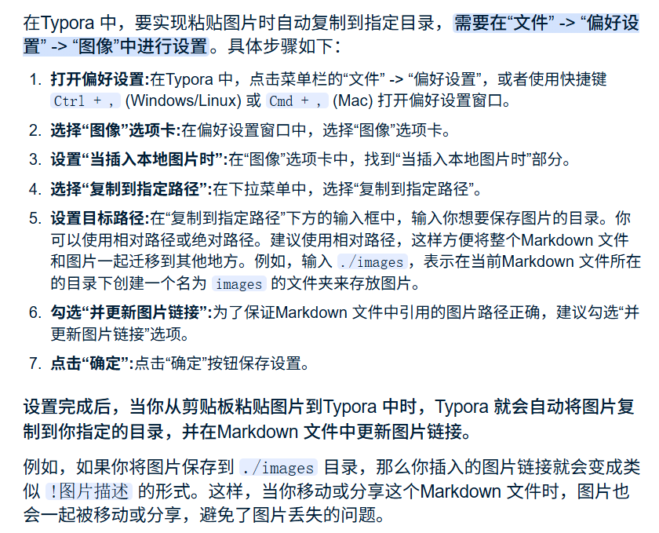

# TZP_weibo

>  本仓库主要用于备份数据：小数据和不重要的数据在Weibo文件夹中，git-file-win-tang包括各种软件的备份数据（还有word和大数据PPT），paper\note主要是学习和论文的笔记（正式学习上）

## 快捷键解释

1. 当前行的下一行添加一行`Shift+Enter`,当前行的上一行添加`Shift+Ctrl+Enter`；代码行快捷键`Ctrl+Shift+`` ；

### 功能使用

[RevIN](#第二种跳转)：这个是跳转的地方

<a name="第二种跳转">RevIN</a>：被跳转的地方（使用a标签加name即可）

<a name="第二种跳转">RevIN</a>：被跳转的地方

### 图片启用相对路径

