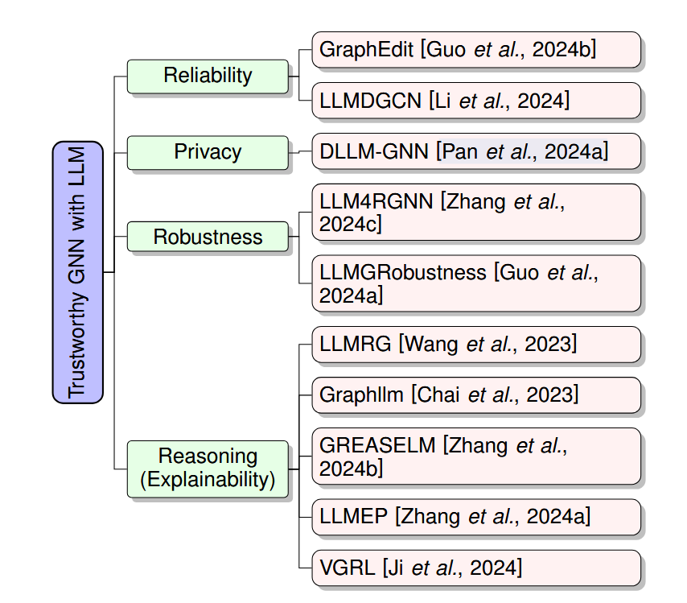

## 综述

### [Trustworthy GNNs with LLMs](https://arxiv.org/pdf/2502.08353)

**Reliability（可靠性）**：面向**非对抗性威胁**（噪声、分布移位）。两条主线：

- **语义增强**：LLM 生成节点嵌入/伪标签/虚拟节点以补全信息、降噪。
- **结构交互**：LLM 直接建议**加/删边**进行结构清洗（如 GraphEdit）。 

**Robustness（鲁棒性）**：抵御**结构/文本扰动与对抗攻击**。研究显示“LLM 作为增强器或预测器”在多类攻击下较浅层模型更稳健；进一步的 **LLM4RGNN** 通过检测恶意边并补全关键边以**修复**被攻击图结构。 

**Privacy（隐私）**：关注成员推断、反演、属性推断、模型窃取等威胁，并讨论差分隐私/联邦学习/删除学习等传统方案与 LLM API 使用带来的新泄露面；提出**从 LLM 向图模型蒸馏**以在**本地**保留性能。  

**Reasoning（推理与可解释）**：利用 LLM 的链式/多步推理提升**解释与逻辑结构化**（如 GraphLLM、GREASELM、LLMEP、VGRL 等），通过自然语言化推理图与可读解释改进透明度。

### [Application of Artificial Intelligence In Drug-target Interactions Prediction](https://www.nature.com/articles/s44385-024-00003-9)

同时，基于大型模型的方法面临着显着的挑战，例如语料库不足，数据一致性困难，冗长的单培训时间，由于参数调整的不确定性以及要求的硬件要求而导致的高反复试验成本。但是，很明显，现在是基于大型模型来推进药品的相互作用预测的合适时机。

简述LLM结合DTI的科学性，启发性综述。

## LLM 作为 GNN(GCN) 的**上游**

1. LLM-DDI: Leveraging Large Language Models  for Drug-Drug Interaction Prediction on  Biomedical Knowledge Graph：主要对这篇文章进行理解，个人对其思想的理解就是，首先用已经训练好的模型形成Embedding向量，然后在BK图（GAT图）扩散再聚合，让节点学习特征；（创新点：首先就是使用LLM从知识图谱中学习分子向量形成嵌入向量，然后再使用GNN实现`消息传递`再`聚合`来学习节点的向量）
2. GCN-LLM：Combining GCN Structural Learning with LLM Chemical Knowledge for Enhanced Virtual Screening：主要是参考其中[代码](https://github.com/radiaberreziga/gcn-llm-virtual-screening)的思想，其中利用LLM的代码在[src/encoding/compute_embeddings.py](https://github.com/radiaberreziga/gcn-llm-virtual-screening/blob/main/src/compute_embeddings.py)，使用的模型是seyonec/ChemBERTa-zinc-base-v1；
3. [GSRF-DTI](https://bmcbiol.biomedcentral.com/articles/10.1186/s12915-024-01949-3)：虽然这篇论文中没有使用到LLM，但最后的那个使用**随机森林 (RF) 来预测 DTI**未来可能可以考虑到，甚至在消融实验里面也可以使用到；
4. [DrugLM](https://github.com/ShPhoebus/DrugLM)-`预测DTI`：【[论文地址](https://www.biorxiv.org/content/10.1101/2025.07.09.657250v1.full.pdf)】把“*自然语言描述→语义嵌入”作为与任何 **DTI** 主干兼容的通用增强模块*（创新点一），提升预训练准确率，然后冻结LLM底层，仅微调上层（创新点二）；没有利用图知识，但是**使用LLM利用文本描述**生成嵌入信息是值得参考的；其中对文本数据进行**两步预处理**；细节上的处理可能用不到，其中还使用蛋白质数据库；
5. ~~**[SP-DTI](https://academic.oup.com/bioinformatics/article/41/3/btaf011/7951882)**：**上游特征融合**（把预训练 **蛋白/药物 LMs** 的表示注入 **GNN**）~~
6. [DTI-LIM](https://pubmed.ncbi.nlm.nih.gov/39221997/)：[代码地址](https://github.com/compbiolabucf/DTI-LM.)：其中使用到`GAN`；LM->GAN->MLP。

## LLM 作为 GNN(GCN) 的**下游**

> 做复核、重排、校准、甚至直接产出预测

[**K-Paths**（2025）](https://arxiv.org/pdf/2502.13344)：从生物医学知识图提取**多样化最短路径**，把这些路径**转成自然语言**喂给 LLM，让 LLM 推断**药—药/药—病**关系；也可据此裁剪子图再交给 GNN。→ 典型“**图→文本→LLM下游预测**”。

[**CBR-DDI**（2025）](https://arxiv.org/html/2505.23034v1)：把 GNN 从 KG 中抽取的结构化知识 + LLM 从历史病例蒸馏的知识做**案例检索与复用**，提升 DDI 预测并强调可解释性。→ “**GNN 产证据 → LLM 复核/整合**”

### 一些奇思妙想

##### 未经论文验证

1. 把通过LLM从DrugBank上学到的描述向量通过加权结合GCN学习到的向量然后做预测；

##### 根据已读论文可能实现的

1. 用LLM对现有的图数据进行处理，增强或者摒弃一些数据之后再应用GCN（想法来源综述，应该是增强鲁棒性）；

## 论文可参考代码

1. [DDI-LLM](https://github.com/sshaghayeghs/DDI-LLM)：仓库代码是论文[Can Large Language Models Understand Molecules?](https://arxiv.org/abs/2402.00024)的工作线，论文的代码在https://github.com/sshaghayeghs/LLaMA-VS-GPT ；

## 代码理解

### Optuna

[Optuna](https://optuna.readthedocs.io/zh-cn/latest/index.html)超参数优化框架：可设置血多超参数，例如学习率、批次大小、隐藏层数量或大小、正则化参数；

一个轻量的**超参数自动优化**框架。它用“**定义-采样-评估-剪枝**”的流程，自动探索超参数空间，帮你找到更优的参数组合。核心特点：

- **TPE 等贝叶斯采样器**：比网格/随机搜索更聪明，能快速聚焦“好区域”。
- **剪枝 (Pruning)**：在训练“看起来不行”的 Trial 上**提前停止**，省时。
- **可视化 & 重要性分析**：看收敛曲线、各参数重要性、参数-得分切片图等。
- **分布式/可复现**：支持 SQLite/MySQL 等后端存储，易于并行与复现。
- **多目标优化**：同时最小化 RMSE、推理时延等。

第一次发现是在学习提升算法XGBoost和LightGBM的时候，调参空间可设置多个参数，在实际案例中记得加上验证集早停显著缩短调参时间并防过拟合；alpha正则化L1系数、lambda正则化L2系数

